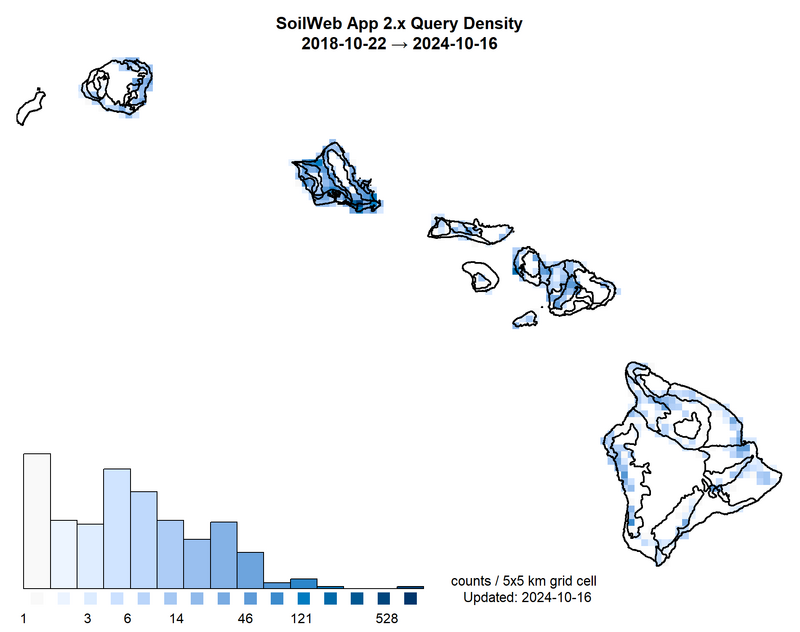

# Access Statistics
Spatial and temporal patterns of requests to USDA-NRCS Soil Survey data.

## Web Soil Survey
Updated semi-annually.

### AOI Centroid Density Maps

### AOI Created per Day

### AOI Creation vs Population Density

### AOI Density by TLD

## SDA

## SoilWeb

[All figures, updated semi-annually.](https://soilmap2-1.lawr.ucdavis.edu/dylan/soilweb-stats/)

### Desktop Application (SoilWeb "Gmaps")

### iOS and Android Smartphone Applications

### Google Earth Application

