# Access Statistics
Spatial and temporal patterns of requests to USDA-NRCS Soil Survey data.

## Web Soil Survey
Updated semi-annually.

### AOI Centroid Density Maps
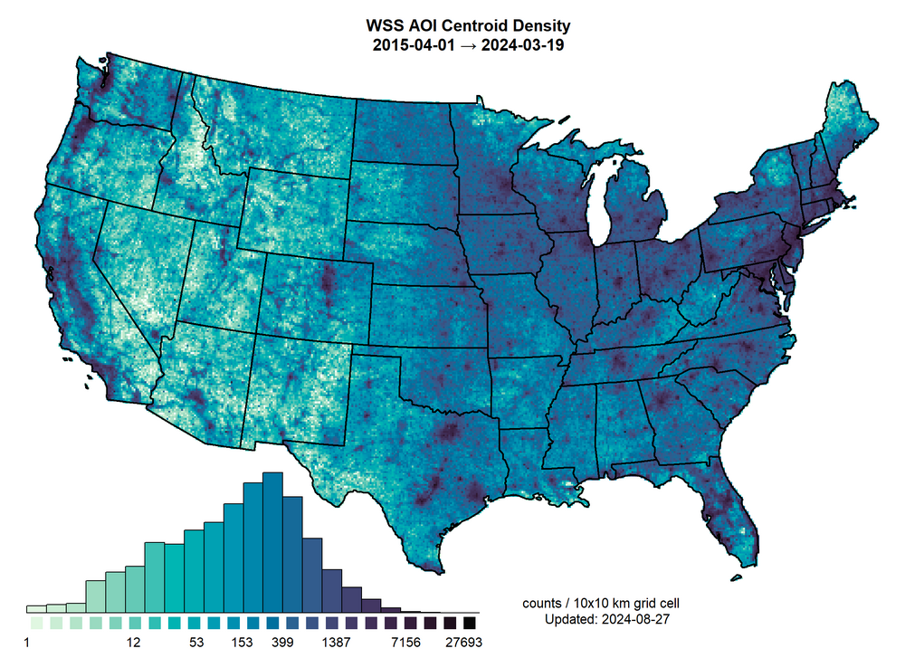

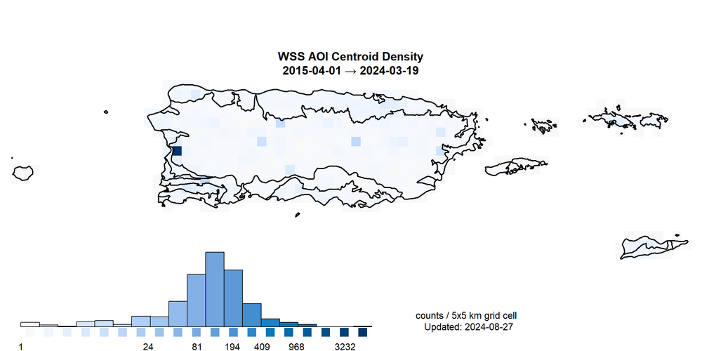

#### Monthly Average

### AOI Created per Day

 
 
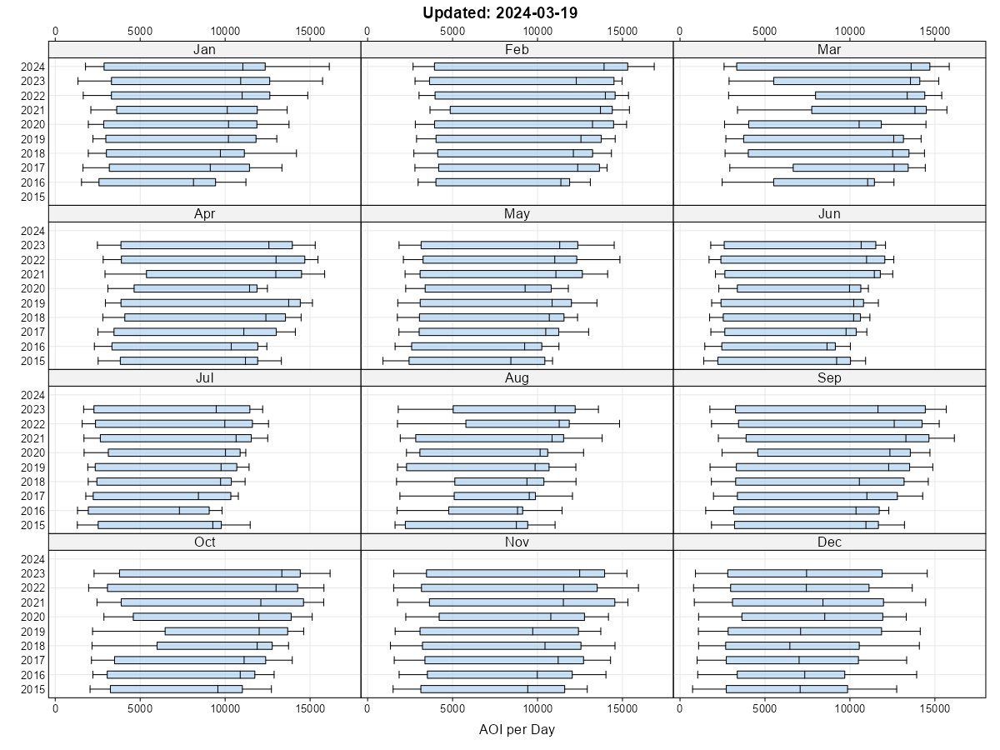

#### AOI By Day of Week and Day of Year

 
 
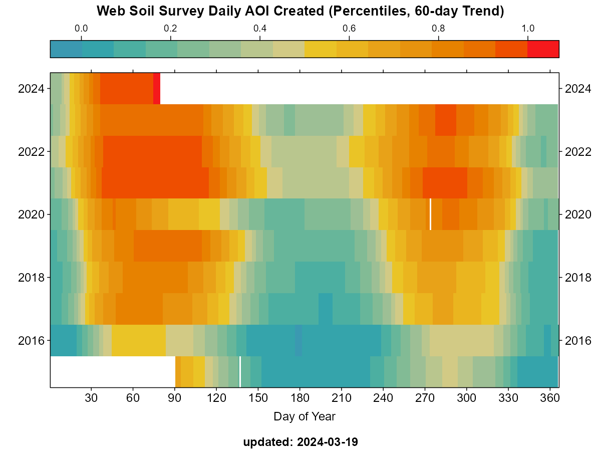

### AOI Creation vs Population Density

### AOI Density by TLD

## SDA

### Daily Queries

## CART

### AOI Centroid Density Maps
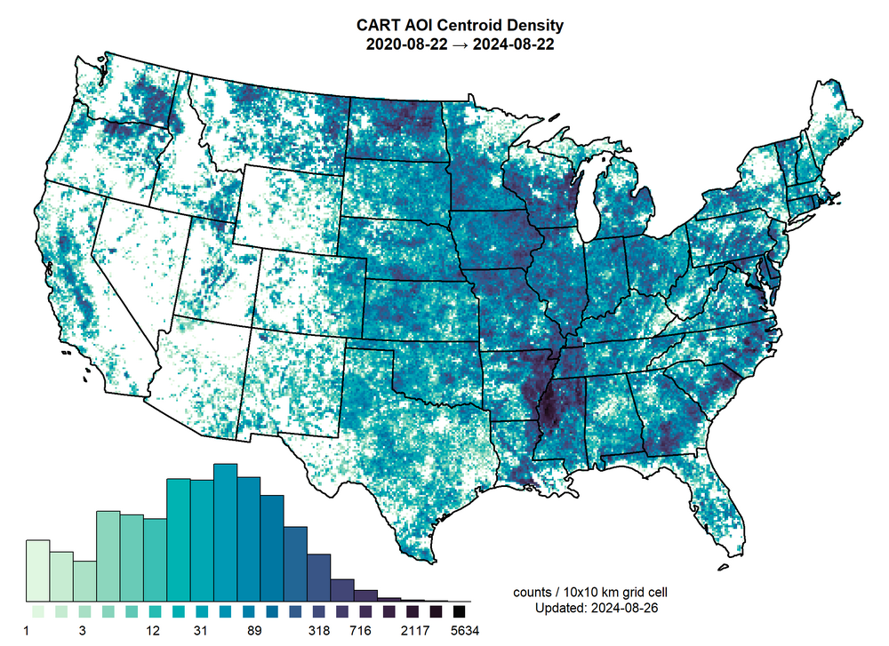
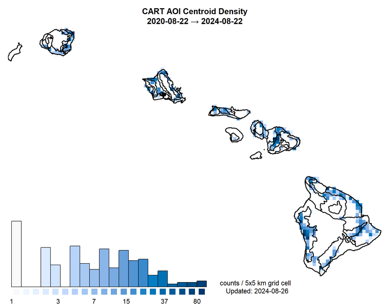
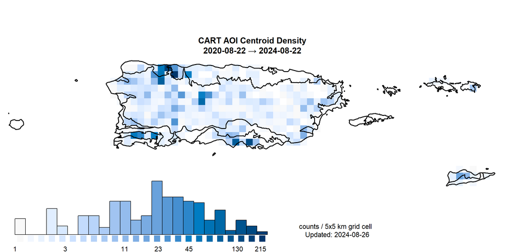

### AOI Created per Day

 
 

#### AOI By Day of Week and Day of Year

 
 

## SoilWeb

[All figures, updated semi-annually.](https://soilmap2-1.lawr.ucdavis.edu/dylan/soilweb-stats/)

### Desktop Application (SoilWeb "Gmaps")
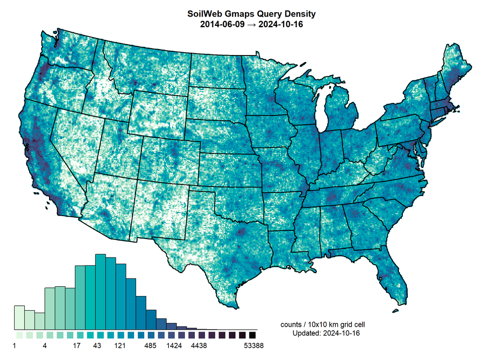
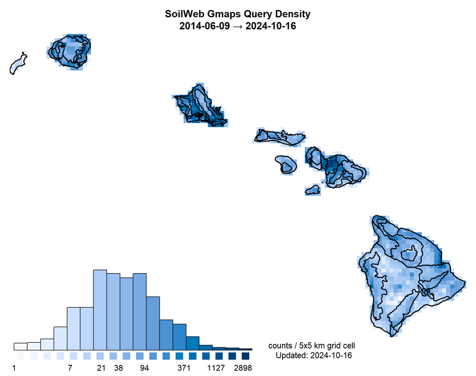

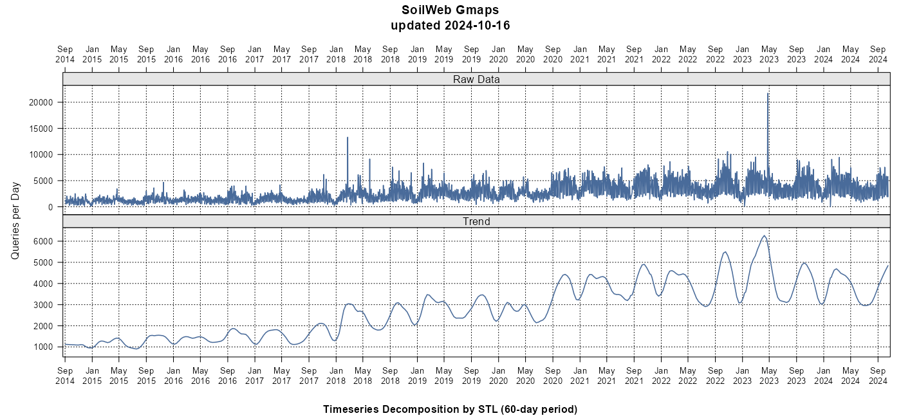
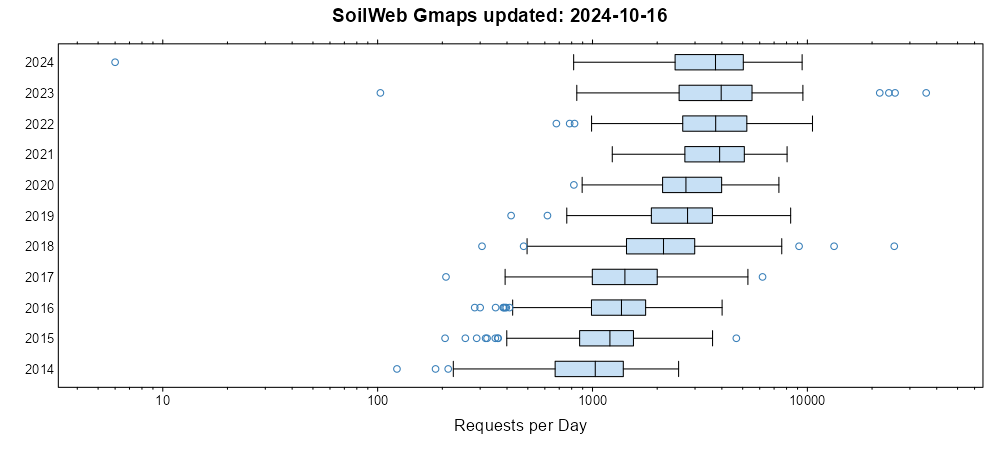

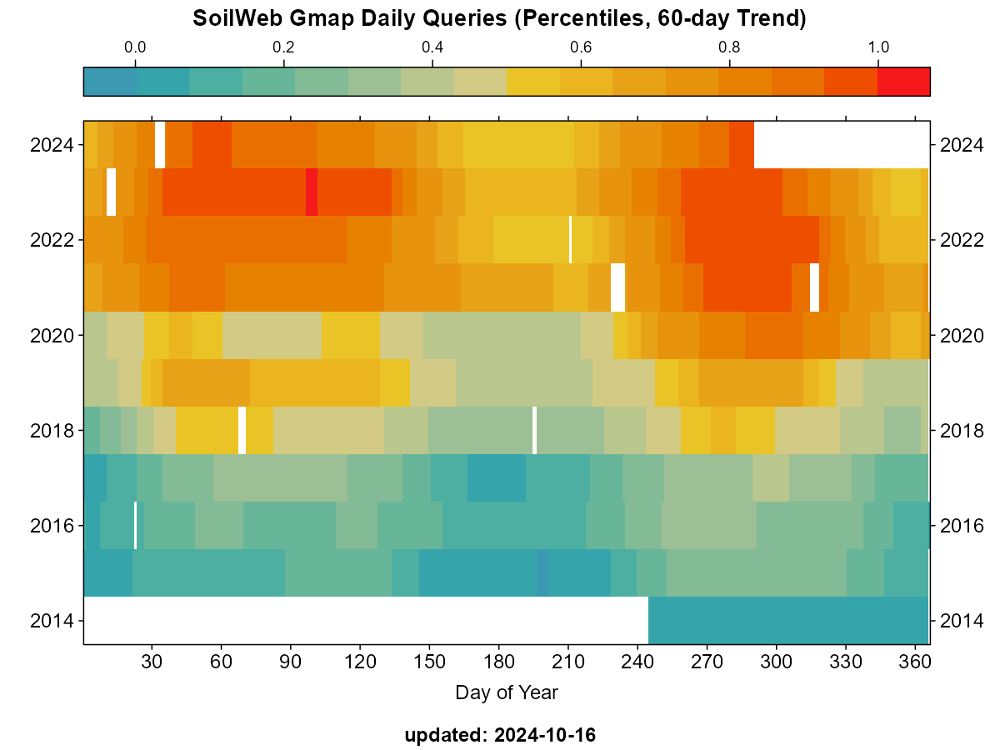

### iOS and Android Smartphone Applications

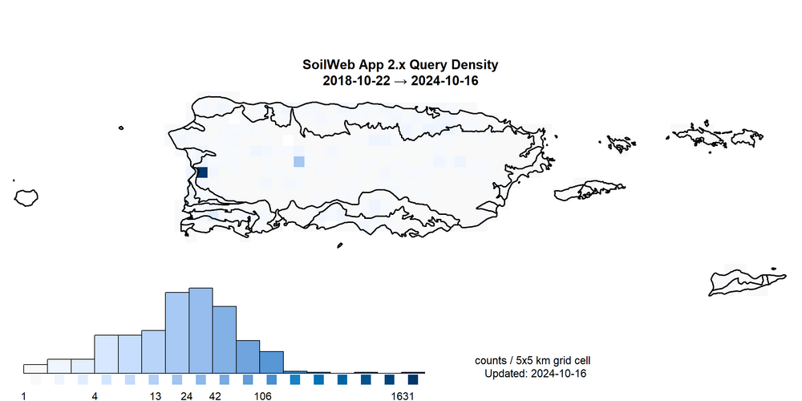

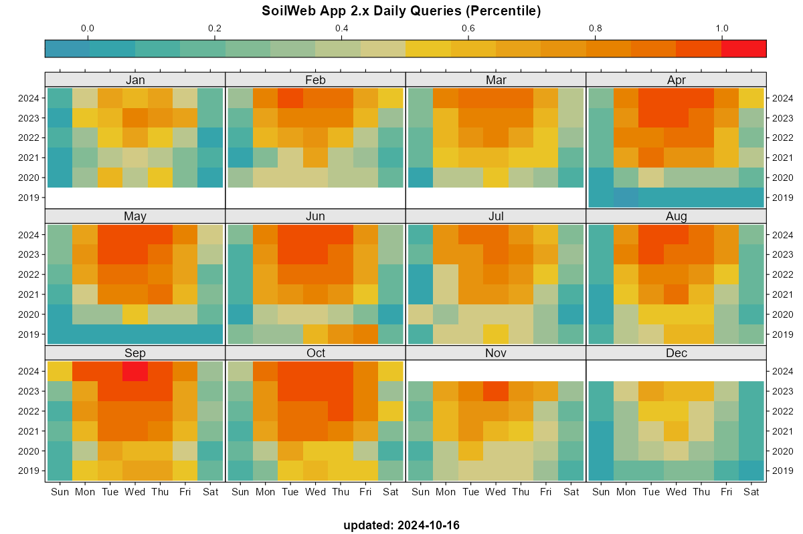
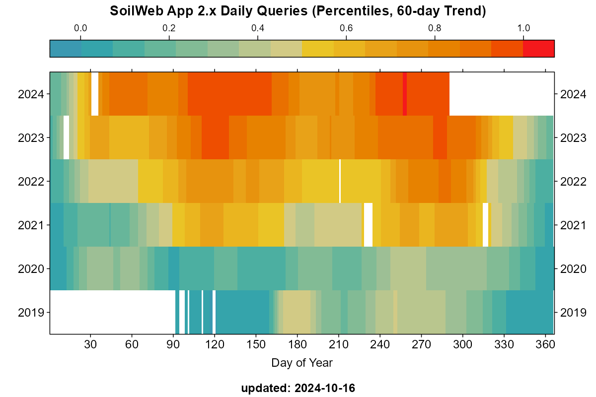

### Google Earth Application

